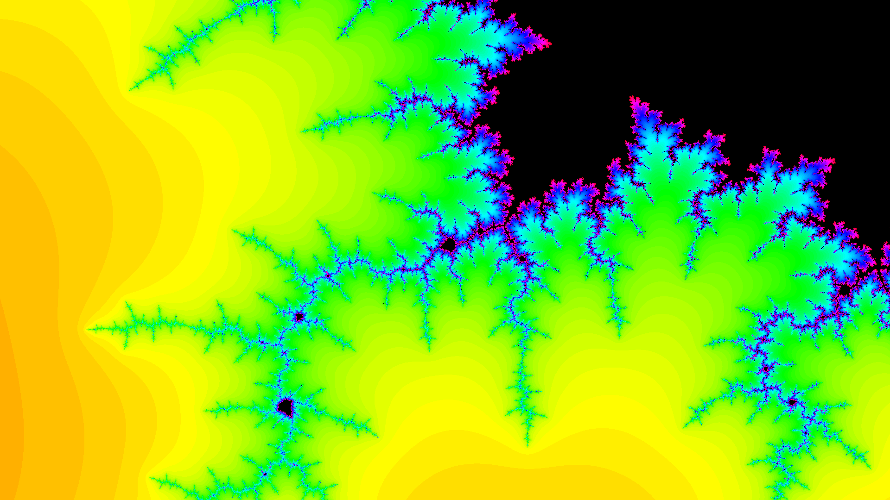
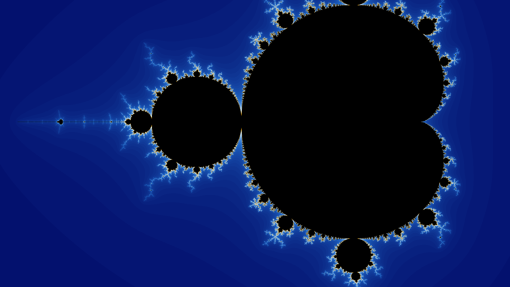
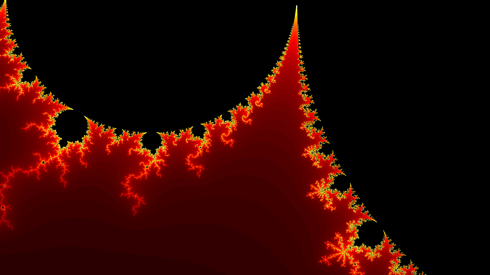
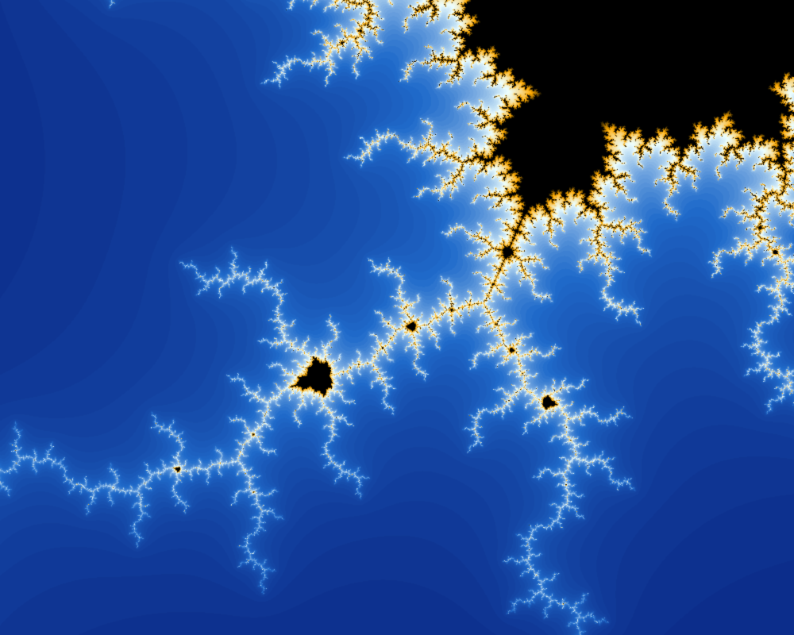
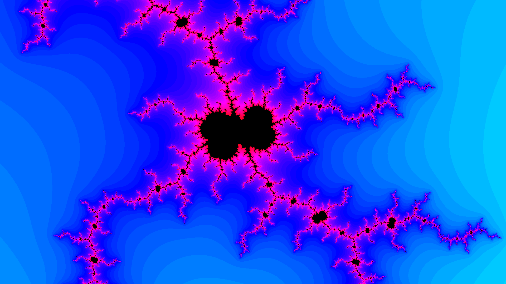
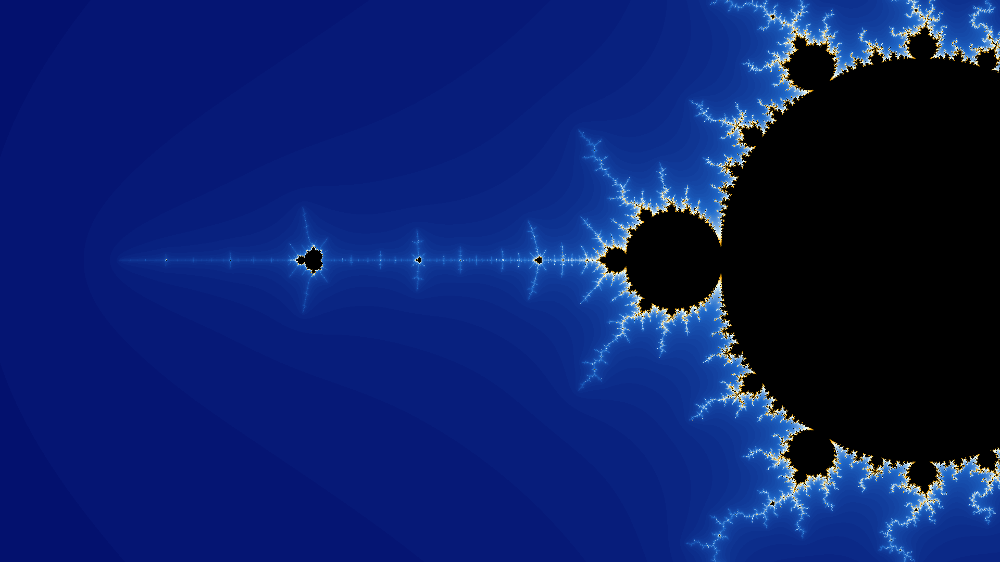
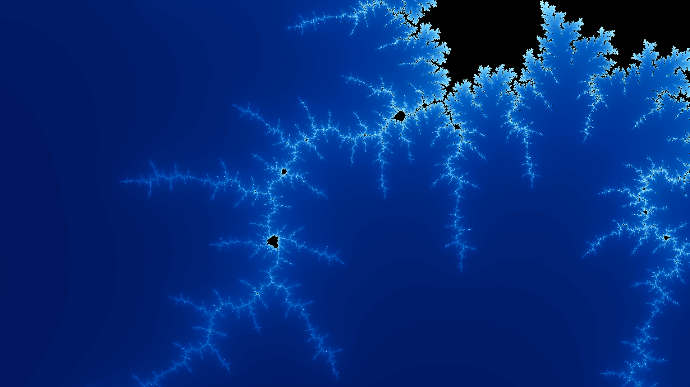
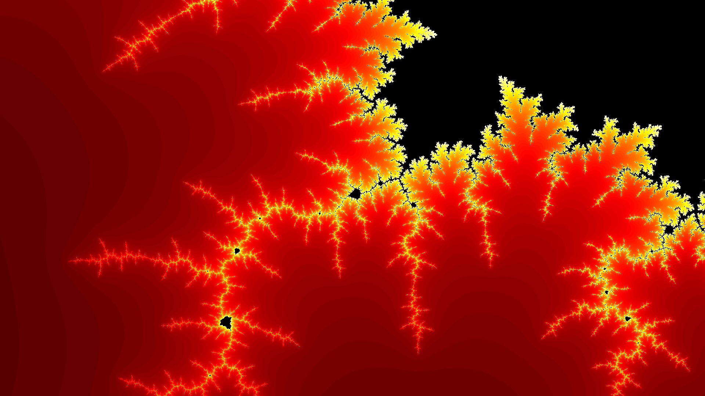

# Mandelbrot Explorer

An advanced JavaFX application for exploring various fractal sets with real-time rendering, multiple calculation strategies, and extensive customization options.


*Explore the infinite beauty of fractals with real-time navigation and customization*

## Features

### Core Functionality

- **Multiple Fractal Types**: Explore different fractal sets including:
  - Mandelbrot Set
  - Julia Sets with customizable parameters
  - Burning Ship Fractal
  - Tricorn (Mandelbar) Fractal
  - Multibrot Fractals (power 3 and 4)
  - Phoenix Fractal

- **Real-time Navigation**:
  - Click and drag to pan around the fractal
  - Smooth zooming with mouse scroll wheel
  - Double-click to zoom in at a specific point
  - Pinch-to-zoom gesture support on trackpads
  - Swipe gestures for quick navigation

- **Performance Options**:
  - Multi-threaded calculation using ExecutorService
  - Fork/Join framework for parallel processing
  - Single-threaded option for comparison
  - Efficient pixel-by-pixel rendering

- **Visual Customization**:
  - Multiple color palettes (Smooth, Classic, Fire, Ocean, Rainbow, Grayscale, High Contrast)
  - Adjustable iteration count (1-10000)
  - Smooth color gradients for better visual quality

### Advanced Features

- **Image Export**:
  - Save current view as PNG/JPG
  - Export high-resolution images (up to 4K and 8K)
  - Batch export capabilities

- **Julia Set Parameters**:
  - Interactive parameter adjustment
  - Preset famous Julia sets (Dragon, Dendrite, Rabbit, etc.)
  - Real-time preview of parameter changes

- **User Interface**:
  - Clean menu-based interface
  - Fullscreen support
  - Status bar with coordinates and zoom level
  - Progress indicator for long calculations

## Keyboard Shortcuts

| Shortcut | Action |
|----------|--------|
| `+` / `-` | Zoom in/out |
| Arrow Keys | Pan in direction |
| `R` | Reset to default view |
| `F` | Cycle through fractal types |
| `C` | Cycle through color palettes |
| `[` / `]` | Decrease/increase iterations |
| `Space` | Recalculate fractal |
| `S` | Save current image |
| `Shift+S` | Save high-resolution image |
| `H` | Show help/keyboard shortcuts |
| `Ctrl+R` | Reset view |
| `Ctrl+S` | Save image |
| `Ctrl+Shift+S` | Save HD image |
| `Ctrl+Q` | Exit application |
| `F11` | Toggle fullscreen |

## Mouse Controls

- **Left Click + Drag**: Pan around the fractal
- **Double Click**: Zoom in at clicked point
- **Right Click**: Zoom out at clicked point
- **Scroll Wheel**: Zoom in/out at cursor position
- **Pinch Gesture**: Zoom in/out (on supported trackpads)
- **Two-finger Swipe**: Quick pan in swipe direction

## Getting Started

### Prerequisites

- Java Development Kit (JDK) 21 or higher
- JavaFX 21 (included via Gradle)

### Installation

1. Clone the repository:
```bash
git clone https://github.com/yourusername/mandelbrot-explorer.git
cd mandelbrot-explorer
```

2. Build the project:
```bash
./gradlew build
```

3. Run the application:
```bash
./gradlew run
```

### Building a Distribution

To create a distributable package:

```bash
./gradlew distZip
```

The distribution will be created in `build/distributions/`.

## Usage Guide

### Exploring Fractals

1. **Select a Fractal Type**: Use the dropdown menu to choose from available fractals
2. **Adjust Iterations**: Higher values reveal more detail but take longer to compute
3. **Navigate**: Click and drag to move around, scroll to zoom
4. **Change Colors**: Select different palettes from the Color dropdown
5. **Save Your Discovery**: Use File > Save Image to capture your view

### Julia Set Exploration

When "Julia Set" is selected, additional controls appear:

1. **Preset Selection**: Choose from famous Julia sets
2. **Custom Parameters**: Enter your own complex number (c = real + imaginary*i)
3. **Apply Changes**: Click Apply or press Enter to update the fractal

### Performance Optimization

- For faster rendering, use lower iteration counts
- The Fork/Join calculator performs best on multi-core systems
- Use Executor Service for balanced performance
- Single-threaded mode is useful for debugging

## Gallery

### Example Fractals

Here are some stunning fractals captured using the Mandelbrot Explorer:

#### Mandelbrot Set Explorations


*Deep zoom into the Mandelbrot set showing intricate spiral patterns*


*Another region revealing self-similar fractal structures*


*Vibrant colors highlighting the boundary complexity*

#### Different Color Palettes


*The same region rendered with the Ocean color palette*


*Dramatic Fire gradient showing depth and detail*

#### Ultra-Deep Zooms


*Incredibly detailed spiral formation at extreme magnification*


*Lightning-like tendrils reaching into the complex plane*


*A miniature Mandelbrot set found deep within the fractal*

### Exploring Different Regions

The Mandelbrot set contains infinite complexity. Some interesting coordinates to explore:

- **Seahorse Valley**: Center at (-0.75, 0.1), Zoom: 500
- **Elephant Valley**: Center at (0.275, 0), Zoom: 1000  
- **Triple Spiral**: Center at (-0.1011, 0.9563), Zoom: 5000
- **Mini Mandelbrot**: Center at (-1.25066, 0.02012), Zoom: 100000

## Technical Details

### Architecture

- **Strategy Pattern**: For swappable calculation algorithms
- **Observer Pattern**: For UI updates and event handling
- **Multi-threading**: Parallel computation for performance
- **Immutable Data**: ComplexNumber records for thread safety

### Fractal Algorithms

Each fractal implements the `Fractal` interface with its unique iteration formula:

- **Mandelbrot**: z(n+1) = z(n)² + c, where c is the pixel coordinate
- **Julia**: z(n+1) = z(n)² + c, where c is a fixed parameter
- **Burning Ship**: z(n+1) = (|Re(z)|+i|Im(z)|)² + c
- **Tricorn**: z(n+1) = conj(z(n))² + c
- **Multibrot**: z(n+1) = z(n)^d + c, where d is the power
- **Phoenix**: z(n+1) = z(n)² + c + p*z(n-1)

## Contributing

Contributions are welcome! Please feel free to submit pull requests or open issues for bugs and feature requests.

## License

This project is open source and available under the MIT License.

## Acknowledgments

- JavaFX community for the excellent graphics framework
- Fractal mathematics community for the beautiful algorithms
- Contributors and testers who helped improve the application