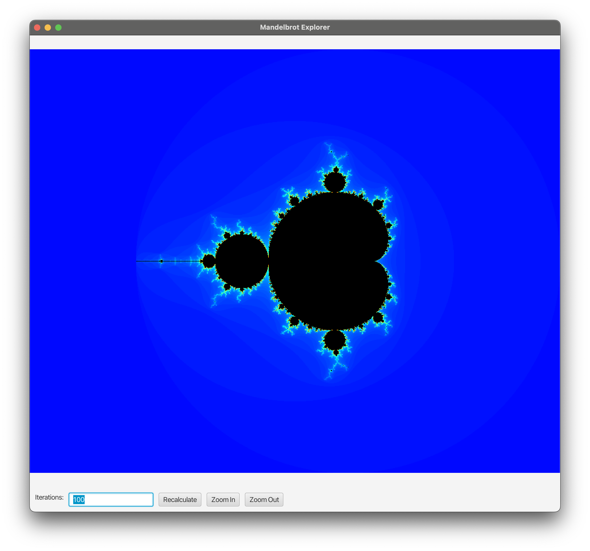
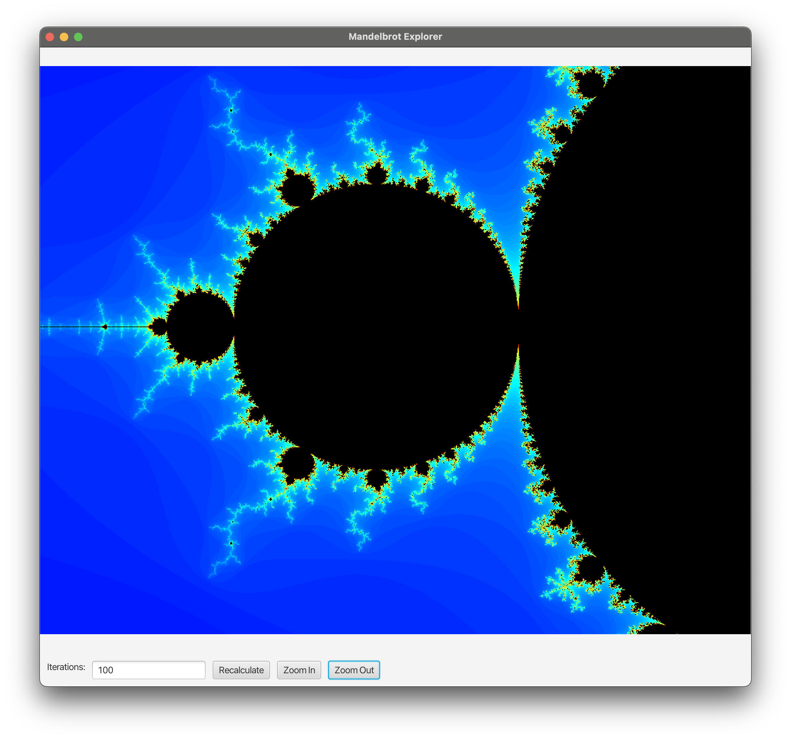
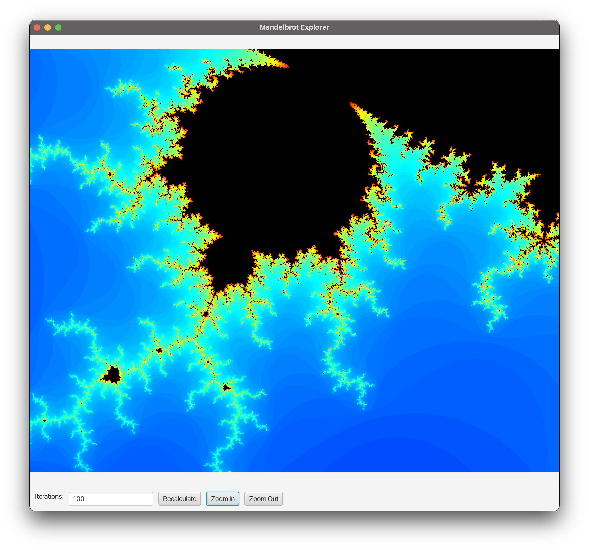
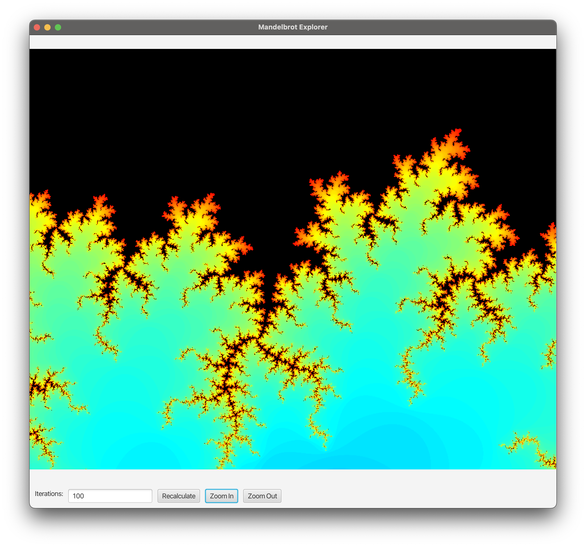
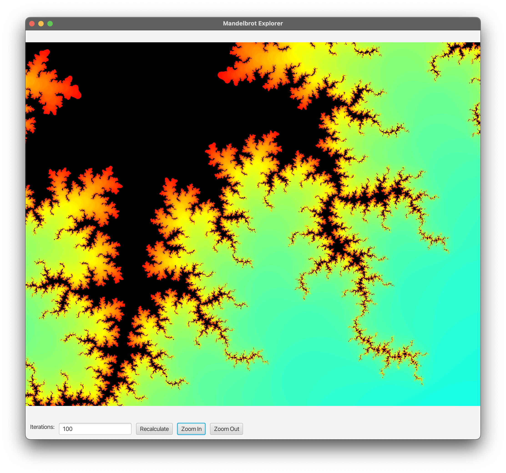
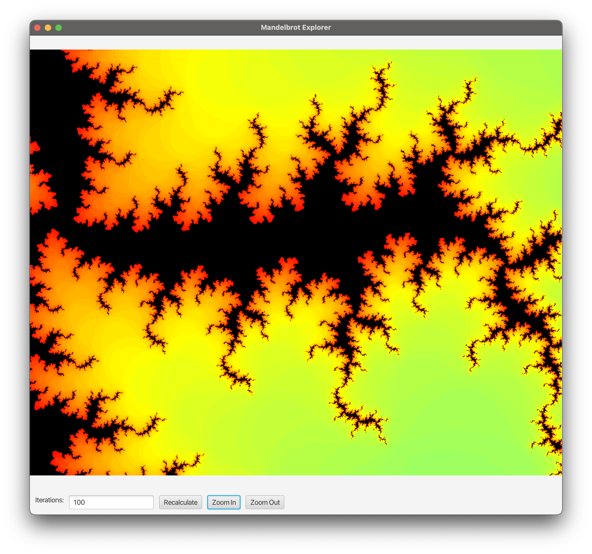
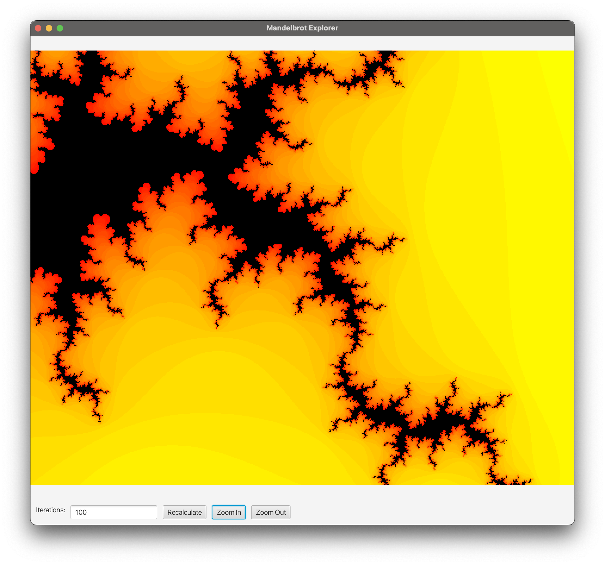

# Mandelbrot Explorer

Mandelbrot Explorer is a JavaFX application that allows users to visualize and explore the Mandelbrot set. You can zoom in and out and drag around to explore different areas of the set.

## Functionality

The application provides the following features:

1. **Visualize the Mandelbrot Set**: The application will display the Mandelbrot set in a window when launched.
2. **Zoom**: The application allows users to zoom in and out of the Mandelbrot set visualization using the "Zoom In" and "Zoom Out" buttons.
3. **Navigation**: Users can navigate different areas of the Mandelbrot set by clicking and dragging their mouse across the visualization.
4. **Custom Iteration**: Users can set the number of iterations to adjust the level of detail in the Mandelbrot set visualization using a text field labeled "Iterations".
5. **Recalculate**: After changing the number of iterations, the user can press the "Recalculate" button to redraw the Mandelbrot set with the new level of detail.

## Getting Started

These instructions will help you get a copy of the project up and running on your local machine for development and testing purposes.

### Prerequisites

To run this application, you will need:

1. Java Development Kit (JDK) 21.
2. JavaFX.

### Installation

1. Clone the repository to your local machine.
2. Open the project in your preferred Java IDE.
3. Make sure that the JDK is set to the correct version (JDK 21) in your IDE's project structure settings.
4. Include the JavaFX library to your project structure.

## Usage

Run the main method in the `MandelbrotApplication` class to start the program. This will open a window showing the Mandelbrot visualization. You can click and drag to pan around the visualization, and use the "Zoom In" and "Zoom Out" buttons to zoom in and out.

## Built With

1. Java SDK 21.
2. JavaFX.

# Outcomes

# Outcomes

This section contains a sequence of images captured during a zoom-in process within the Mandelbrot set.

*Initial view of the Mandelbrot set.*

*Zoom level 1.*

*Zoom level 2.*

*Zoom level 3.*

*Zoom level 4.*

*Zoom level 5.*

*Final zoom level.*

## Future Work

The following points highlight the planned enhancements for the Mandelbrot Explorer:

1. **Additional Fractal Sets**: The current version of the application only supports the Mandelbrot set. We plan to add support for more fractal sets such as the Julia set, Burning Ship fractal, and others to provide users with more options for exploration.

2. **Save Fractals Functionality**: We aim to empower users to save their favorite fractal images. The users will be able to save any fractal, at any zoom level, they create by simply clicking a "Save Fractal" button. The saved images may then be viewed later or used for other purposes.

3. **Bookmark Locations**: In a future release, we are planning to include a feature that lets users bookmark their favorite spots within the fractal sets. This capability will allow users to quickly revisit their favorite discoveries.

Keep an eye on our GitHub repository for updates and new feature releases.